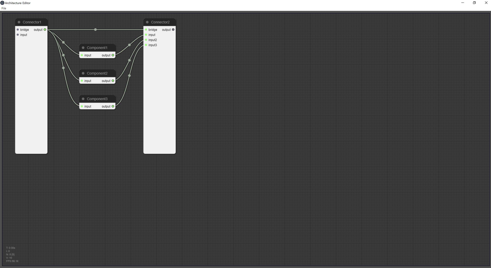

# aframe
A python implementation framework and editor for a component-and-connector based architectural style.

Editor currently uses electron and [lightgraph.js](https://github.com/jagenjo/litegraph.js)

## Screenshots

